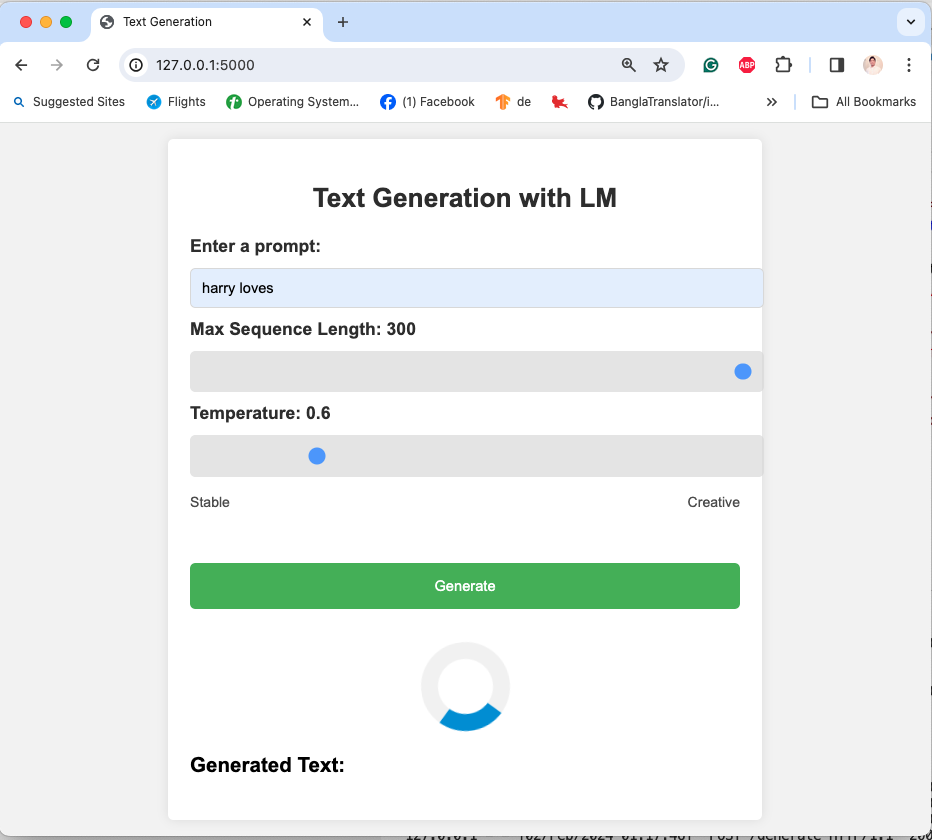
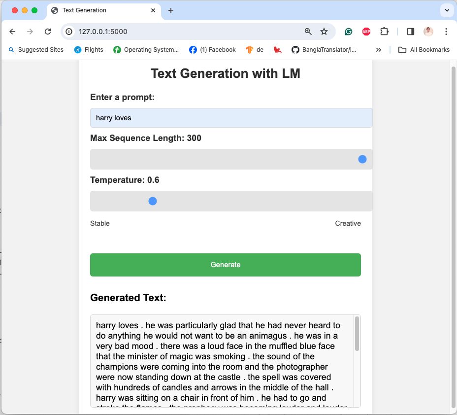

# LSTM Language Models README

## Table of Contents
- [Overview](#overview)
- [Task 1: Preparation and Training](#task-1-preparation-and-training)
  - [Foundational Research Papers](#11-foundational-research-papers)
  - [Data Description](#12-data-description)
  - [Technical Components](#13-technical-components)
  - [Getting Started](#14-getting-started)
- [Task 2: Model Comparison and Analysis](#task-2-model-comparison-and-analysis)
- [Task 3: Text Generation - Web Application Development](#task-3-text-generation---web-application-development)
- [Contributing & Support](#contributing--support)
- [License](#license)
- [Acknowledgments](#acknowledgments)


## Overview
This project focuses on developing and analyzing LSTM language models. It encompasses the training of models on the Harry Potter Books Dataset, comparing various model architectures, and deploying a Flask-based web application for interactive text generation.

## Task 1: Preparation and Training
This task involves setting up the project, preparing the data, and training the LSTM language model.

### 1.1 Foundational Research Papers
The model is inspired by the paper ["Regularizing and Optimizing LSTM Language Models"](https://arxiv.org/abs/1708.02182). The paper provides a foundational understanding of the LSTM mechanisms and optimization techniques employed in this project.

### 1.2 Data Description
- **Website**: [HPD Dataset Download](https://nuochenpku.github.io/HPD.github.io/download)
- **Research Background of the dataset**: Utilized in the study for enhancing dialogue agents and character alignment in AI models, detailed in the paper [Dialogue-style Large Language Models for Character Alignment in Open-domain Dialogue Agents](https://arxiv.org/abs/2211.06869).

#### Dataset Description
- Contains text from the Harry Potter novels (7 books) in txt format, structured for training and evaluating Language Models (LLMs) like ChatGPT and GPT4.

#### Institutions
- **Developed by**: Tencent AI Lab & Department of Systems Analysis (DSA), Hong Kong University of Science and Technology (Guangzhou), and Hong Kong University of Science and Technology.

---

For additional details or to access the dataset, visit the [HPD Dataset Download page](https://nuochenpku.github.io/HPD.github.io/download).


### 1.3 Technical Components
#### Data Preparation
- **Tokenization**: Utilizes the `torchtext.data.utils.get_tokenizer` function to tokenize the text data, effectively splitting it into individual words or tokens.
- **Numericalizing**: Constructs a vocabulary from the tokenized text using `torchtext.vocab` and converts tokens into numerical indices, providing a standard format for model input.
- **Dataset Splitting**: Divides the tokenized text data into training, validation, and testing sets, ensuring a balanced distribution for model training and evaluation.

    | Dataset       | Number of Tokens |
    |---------------|------------------|
    | Training(70%)      | 926,599          |
    | Validation(15%)    | 198,557          |
    | Test(15%)          | 198,558          |
    | **Total**     | **1,323,714**    |

#### Modeling
- **LSTM Architecture**: Implements an LSTM language model using PyTorch's `nn.Module`. The architecture includes embedding layers, LSTM layers, dropout layers, and a fully connected layer.
- **Weight Initialization**: Employs uniform weight initialization for embedding and fully connected layers, and specific LSTM weight initialization for input-hidden and hidden-hidden connections.
- **Hidden State Management**: Manages hidden states efficiently, allowing for proper handling across training iterations and providing functions to initialize and detach hidden states.

#### Training
- **Hyperparameter Adjustment**: Configures model hyperparameters such as the number of layers, embedding dimension, hidden dimension, dropout rate, and learning rate.
- **Gradient Clipping**: Implements gradient clipping to prevent exploding gradients during backpropagation, maintaining model stability.
- **Learning Rate Schedulers**: Uses a learning rate scheduler (`ReduceLROnPlateau`) to adjust the learning rate based on validation loss, aiding in model convergence and avoiding overfitting.
- **Batch Processing**: Employs batch processing for efficient model training, reshaping the data into batches of a specified size.
- **Loss Function**: Utilizes Cross-Entropy Loss, suitable for multi-class classification tasks, to compute the loss between predictions and targets.
- **Optimizer**: Adopts the Adam optimizer for model training, updating model parameters based on computed gradients.
- **Evaluation Metrics**: Employs perplexity as the primary metric for model evaluation, providing insight into the model's performance in predicting the next word in a sequence.


### 1.4 Getting Started

To get started with the LSTM language model project, follow these steps to set up the environment, prepare the data, and initiate the training process:

1. **Environment Setup**:
    - Ensure you have Python 3.6+ installed.
    - Create a virtual environment to manage dependencies:
      ```bash
      python -m venv venv
      ```
    - Activate the virtual environment:
      - On Windows: `venv\Scripts\activate`
      - On macOS/Linux: `source venv/bin/activate`
    - Install the required dependencies:
      ```bash
      pip install -r requirements.txt
      ```


## Task 2: Model Comparison and Analysis

### Model Performance Report

This report provides an analysis of the LSTM language model's training performance over 50 epochs, focusing primarily on minimizing Train and Valid Perplexity, and offering an evaluation based on Test Perplexity.

#### Results
- **Total Training Time:** 48 minutes and 12 seconds.
- **Optimal Epoch:** 30
  - **Train Perplexity:** 45.028
  - **Valid Perplexity:** 88.476
  - **Test Perplexity:** 106.331

#### Analysis
The model demonstrated consistent improvement throughout the training epochs, with Epoch 30 yielding the most balanced performance. The Test Perplexity, while higher than the Validation Perplexity, remains within a reasonable range, suggesting good generalization of the model to unseen data. `However, the noticeable gap between Test and Validation Perplexity indicates potential areas for further model refinement.`

#### Recommendations for Further Improvement
1. **Early Stopping:** Implement an early stopping mechanism to halt training when the Validation Perplexity no longer shows significant improvement. This approach can prevent overfitting and reduce unnecessary computational overhead.
2. **Hyperparameter Tuning:** Conduct thorough experimentation with various sets of hyperparameters to optimize the model's performance further. Consider exploring different learning rates, batch sizes, and LSTM configurations.
3. **Extended Dataset:** Enrich the training dataset with more diverse or comprehensive data sources. This expansion can enhance the model's ability to learn and generalize across a wider array of textual contexts.
4. **Advanced Architectures:** Investigate the integration of more sophisticated model architectures, such as Transformer-based models or attention mechanisms, to potentially capture the dataset's complexities more effectively and improve predictive performance.

This analysis and the subsequent recommendations aim to guide further development and optimization of the LSTM language model, promoting advancements in performance and applicability.


## Task 3: Text Generation - Web Application Development

This task focuses on deploying the trained LSTM language model as an interactive web application using Flask. The application allows users to input custom prompts and generate text based on those prompts, showcasing the model's text generation capabilities in a user-friendly format.

### Web Application Features
- **Interactive Interface**: Users can input a prompt and adjust parameters such as maximum sequence length and temperature for text generation.
- **Real-time Text Generation**: The model generates text in real-time, providing immediate feedback based on the user's input.
- **Parameter Tuning**: Users can experiment with different temperatures to influence the creativity and coherence of the generated text.

### Getting Started with the Web Application
1. **Set Up the Flask Environment**:
   - Navigate to the Flask application directory.
   - Ensure all dependencies are installed: `pip install -r requirements.txt`.

2. **Start the Flask Server**:
   - Run the Flask server with  
        ```sh
        python app.py
        ```
   - The server typically starts at [http://127.0.0.1:5000](http://127.0.0.1:5000).


   

   

   ***For Live Demo from Huggingface Space [https://huggingface.co/spaces/shaficse/a2-text-gen](https://huggingface.co/spaces/shaficse/a2-text-gen)***
3. **Interact with the Application**:
   - Access the web application through the provided URL.
   - Input your prompt and adjust generation parameters as desired.
   - Click 'Generate' to view the model's text output.

### Application Architecture
- **Flask Backend**: Handles requests, interacts with the LSTM model, and serves the generated text.
- **Frontend Interface**: Provides an intuitive UI for users to interact with the model, built using HTML, CSS, and JavaScript.
- **Model Integration**: Seamlessly integrates the trained LSTM model to perform text generation based on user input.

This development phase brings the LSTM language model to a wider audience, allowing for interactive engagement and demonstration of the model's text generation prowess through a web-based platform.


## Contributing & Support
Contributions are welcome. For issues or questions, please open an issue in the repository.

## License
This project is licensed under the MIT License.[LICENSE](LICENSE)

## Acknowledgments

- **Research Inspiration**: Sincere thanks to the authors of the foundational research paper, "Regularizing and Optimizing LSTM Language Models," which provided crucial insights and methodologies for this project.
- **Resource Contributions**: Special appreciation to [Chaklam Silpasuwanchai](https://github.com/chaklam-silpasuwanchai) for his invaluable contributions. The codebase for this project drew inspiration and guidance from his [Python for Natural Language Processing](https://github.com/chaklam-silpasuwanchai/Python-for-Natural-Language-Processing) repository, serving as a vital resource.
- **Dataset Providers**: Heartfelt gratitude to the curators and maintainers of the Harry Potter dataset, whose efforts in compiling and structuring the data have been instrumental for the training and evaluation of the LSTM language models in this project.

These acknowledgments reflect the collaborative spirit and valuable contributions that have significantly enriched this project, and we extend our sincere gratitude to everyone involved.
